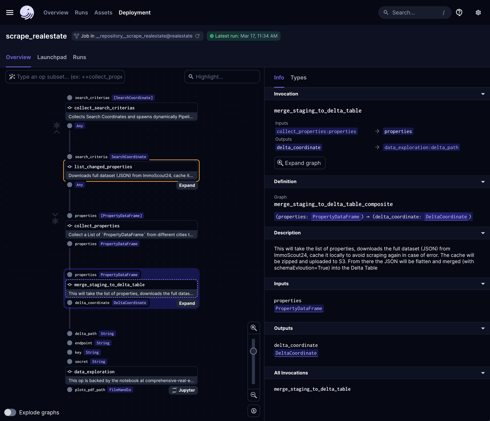

<p align="left">
<a href="https://www.ssp.sh/" target="_blank"></a>
</p>

# Practical Data Engineering: A Hands-On Real-Estate Project Guide

[](https://www.ssp.sh/blog/data-engineering-project-in-twenty-minutes/)

This repository containts a practical implementation of a data engineering project that spans across web-scraping real-estates, processing with Spark and Delta Lake, adding data science with Jupyter Notebooks, ingesting data into Apache Druid, visualizing with Apache Superset, and managing workflows with Dagster—all orchestrated on Kubernetes.

**Built your own DE project or forked mine? Let me know in the comments; I'd be curious to know more about.**

## About This Project

This Practical Data Engineering project addresses common data engineering challenges while exploring innovative technologies. It should serve as a learning project but incorporate comprehensive real-world use cases. It's a guide to building a data application that collects real-estate data, enriches it with various metrics, and offers insights through machine learning and data visualization. This application helps you find your dream properties in your area and showcases how to handle a full-fledged data engineering pipeline using modern tools and frameworks.

### Why this project?
- **Real-World Application**: Tackling a genuine problem with real estate data to find the best properties.
- **Comprehensive Tech Stack**: Utilizes a wide range of technologies from web scraping, S3 storage, data processing, machine learning, to data visualization and orchestration.
- **Hands-On Learning**: Offers a hands-on approach to understanding how different technologies integrate and complement each other in a real-world scenario.

### Key Features & Learnings:
- Scraping real estate listings with [Beautiful Soup](https://beautiful-soup-4.readthedocs.io/en/latest/index.html)
- Change Data Capture (CDC) mechanisms for efficient data updates
- Utilizing [SeaweedFS](https://github.com/seaweedfs/seaweedfs) as an S3-compatible object store for cloud-agnostic storage
- Implementing UPSERTs and ACID transactions with [Delta Lake](https://delta.io/)
- Integrating [Jupyter Notebooks](https://github.com/jupyter/notebook) for data science tasks
- Visualizing data with [Apache Superset](https://github.com/apache/superset)
- Orchestrating workflows with [Dagster](https://github.com/dagster-io/dagster/)
- Deploying on [Kubernetes](https://github.com/kubernetes/kubernetes) for scalability and cloud-agnostic architecture

### Technologies, Tools, and Frameworks:
This project leverages a vast array of open-source technologies including SeaweedFS, Delta Lake, Jupyter Notebooks, Apache Druid, Apache Superset, and Dagster—all running on Kubernetes to ensure scalability and cloud-agnostic deployment.

<p align="center">

</p>

### Project Evolution and Updates

This project started in November 2020 as a project for me to learn and teach about data engineering. I published the entire project in March 2021 (see the initial version on [branch `v1`](https://github.com/sspaeti-com/practical-data-engineering/tree/v1)). Three years later, it's interesting that the tools used in this project are still used today. We always say how fast the Modern Data Stack changes, but if you choose wisely, you see that good tools will stay the time. Today, in `March 2024`, I updated the project to the latest Dagster and representative tools versions. I kept most technologies, except Apache Spark. It was a nightmare to setup locally and to work with Delta Lake SQL APi. I replaced it with [delta-rs](https://github.com/delta-io/delta-rs) direct, which is implemented in Rust and can edit and write Delta Tables directly in Python.

**March 2026 Update**: Migrated from Dagster 1.5.1 to 1.12.x with modern patterns (`import dagster as dg`, `ConfigurableResource`, `Definitions`). Replaced MinIO with [SeaweedFS](https://github.com/seaweedfs/seaweedfs) for S3-compatible storage. Added Docker Compose setup for Apache Druid. All ops/graphs/jobs modernized while keeping the same pipeline logic. Spark code is kept as commented reference for future reactivation via Dagster Pipes.

## Installation & Usage

### Prerequisites:
- Python 3.10-3.13 and [uv](https://docs.astral.sh/uv/) for dependency management
- Docker for running SeaweedFS (S3 storage) and optional services
- Basic understanding of Python and SQL

### Quick Start:

```sh
# change to the pipeline directory
cd src/pipelines/real-estate

# install dependencies
uv sync --all-extras

# start SeaweedFS (S3-compatible object store)
weed server -s3 -s3.config=seaweedfs-s3.json -dir=/tmp/seaweedfs
# or: make s3

# start dagster (in another terminal)
uv run dagster dev
```

Open http://127.0.0.1:3000 in your browser to access the Dagster UI.

### SeaweedFS (S3 Storage)

This project uses [SeaweedFS](https://github.com/seaweedfs/seaweedfs) as an S3-compatible object store, replacing the previously used MinIO. SeaweedFS is lightweight and provides full S3 API compatibility on port 8333.

**Docker:**
```sh
docker compose up seaweedfs -d
```

**Standalone:**
```sh
# Install via package manager or download from https://github.com/seaweedfs/seaweedfs/releases
# On Arch Linux:
yay -S seaweedfs

# Run with S3 enabled (from the real-estate directory)
weed server -s3 -s3.config=seaweedfs-s3.json -dir=/tmp/seaweedfs
# or: make s3
```

The `-s3.config` flag points to `seaweedfs-s3.json` which defines the `admin`/`admin` credentials. Without it, SeaweedFS rejects all authenticated requests.

**Configuration:**

The pipeline reads S3 credentials from environment variables with these defaults:

| Variable | Default | Description |
|---|---|---|
| `S3_ACCESS_KEY` | `admin` | S3 access key |
| `S3_SECRET_KEY` | `admin` | S3 secret key |
| `S3_ENDPOINT` | `http://127.0.0.1:8333` | S3 endpoint URL |

SeaweedFS auto-creates buckets on first write, so no manual bucket setup is needed.

The UI is accessable at [http://localhost:9333/](http://localhost:9333/). And also install the bucket initially once with `aws --endpoint-url http://127.0.0.1:8333 s3 mb s3://real-estate`.

**Migrating from MinIO:**

If you have existing data in MinIO, you can copy it to SeaweedFS using any S3-compatible tool:
```sh
# Using aws cli
aws s3 sync s3://real-estate s3://real-estate \
  --source-endpoint-url http://127.0.0.1:9000 \
  --endpoint-url http://127.0.0.1:8333
```

### Apache Druid (Optional)

The pipeline includes an optional Druid ingestion step for OLAP analytics. The `docker-compose.yml` includes a full Druid cluster (Coordinator, Broker, Historical, MiddleManager, Router) with Zookeeper and a PostgreSQL metadata store.

```sh
# Start the full Druid stack
docker compose up druid-router -d

# Druid UI available at http://127.0.0.1:8888
```

Druid is configured to use SeaweedFS for deep storage. The `ingest_druid` op is available in the codebase but not yet wired into the main pipeline graph. To activate it, uncomment the relevant lines in `realestate/pipelines.py`.

### Running Tests

```sh
uv run pytest realestate_tests/ -v
```

## Visualizing the Pipeline



## Resources & Further Reading
- [Building a Data Engineering Project in 20 Minutes](https://www.ssp.sh/blog/data-engineering-project-in-twenty-minutes/): Access the full blog post detailing the project's development, challenges, and solutions.
- [DevOps Repositories](https://github.com/sspaeti-com/data-engineering-devops): Explore the setup for Druid, SeaweedFS and other components.
- [Business Intelligence Meets Data Engineering with Emerging Technologies](https://www.ssp.sh/blog/business-intelligence-meets-data-engineering/): An earlier post that dives into some of the technologies used in this project.
- [Data Engineering Vault](https://vault.ssp.sh/): A collection of resources, tutorials, and guides for data engineering projects.
- [Open-Source Data Engineering Projects](https://www.ssp.sh/brain/open-source-data-engineering-projects/): A curated list of open-source data engineering projects to explore.

## Feedback
Your feedback is invaluable to improve this project. If you've built your project based on this repository or have suggestions, please let me know through creating an Issues or a Pull Request directly.

---

*This project is part of my journey in exploring data engineering challenges and solutions. It's an open invitation for everyone interested in data engineering to learn, contribute, and share your experiences.*

*Below some impressions of the jupyter notebook used in this project.*


<p align="center">


</p>
